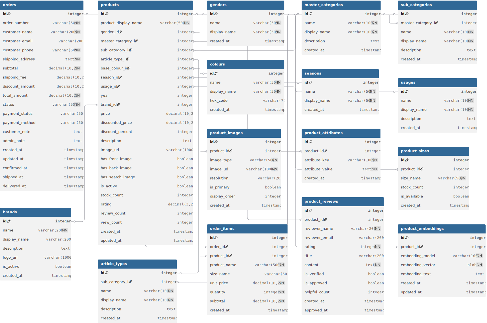

# Fashion Store MVP - 資料庫設計文件

**建立日期**: 2025-11-20  
**資料庫類型**: SQLite (開發環境) / PostgreSQL (生產環境)  
**資料來源**: Fashion Product Images Dataset (Kaggle)

---

## 📋 目錄

- [設計原則](#設計原則)
- [資料表結構](#資料表結構)
  - [核心表：商品資料](#核心表商品資料)
  - [查找表 (Lookup Tables)](#查找表-lookup-tables)
  - [擴展表：商品詳細資訊](#擴展表商品詳細資訊)
  - [訂單系統](#訂單系統-phase-1)
  - [商品評論系統](#商品評論系統-phase-2)
  - [AI 推薦系統](#ai-推薦系統-phase-3)
- [資料表關聯圖](#資料表關聯圖)
- [索引策略](#索引策略)
- [資料遷移計劃](#資料遷移計劃)

---

## 🎯 設計原則

1. **正規化設計**：避免資料重複，使用查找表 (Lookup Tables) 管理分類、顏色等固定選項
2. **關聯完整性**：使用外鍵確保資料一致性
3. **效能優化**：為常用查詢欄位建立索引
4. **擴展性**：設計支援未來功能擴展（評論、AI 推薦等）
5. **資料快照**：訂單系統儲存商品資訊快照，避免後續價格變動影響歷史訂單
6. **軟刪除**：使用 `is_active` 標記而非實際刪除資料

---

## 📊 資料表結構

### 核心表：商品資料

#### 1. `products` - 商品主表

儲存所有商品的核心資訊，是整個系統的中心資料表。

| 欄位名稱 | 資料型態 | 約束條件 | 說明 |
|---------|---------|---------|------|
| **id** | INTEGER | PRIMARY KEY | 商品唯一識別碼（來自 CSV） |
| **product_display_name** | VARCHAR(500) | NOT NULL | 商品顯示名稱 |
| | | | |
| **分類關聯** | | | |
| gender_id | INTEGER | FK → genders.id | 性別分類 |
| master_category_id | INTEGER | FK → master_categories.id | 主分類（服飾/配件/鞋類等） |
| sub_category_id | INTEGER | FK → sub_categories.id | 子分類（上衣/下著/鞋子等） |
| article_type_id | INTEGER | FK → article_types.id | 商品類型（T恤/牛仔褲/手錶等） |
| | | | |
| **商品屬性** | | | |
| base_colour_id | INTEGER | FK → colours.id | 基礎顏色 |
| season_id | INTEGER | FK → seasons.id | 適用季節 |
| usage_id | INTEGER | FK → usages.id | 使用場合 |
| year | INTEGER | | 年份 |
| | | | |
| **品牌與價格** | | | |
| brand_id | INTEGER | FK → brands.id | 品牌 |
| price | DECIMAL(10,2) | | 原價 |
| discounted_price | DECIMAL(10,2) | | 折扣價 |
| discount_percent | INTEGER | | 折扣百分比 |
| | | | |
| **商品描述** | | | |
| description | TEXT | | 商品詳細描述（來自 JSON） |
| | | | |
| **圖片資訊** | | | |
| image_url | VARCHAR(1000) | | 主圖片 URL |
| has_front_image | BOOLEAN | DEFAULT false | 是否有正面圖 |
| has_back_image | BOOLEAN | DEFAULT false | 是否有背面圖 |
| has_search_image | BOOLEAN | DEFAULT false | 是否有搜尋用圖 |
| | | | |
| **商品狀態** | | | |
| is_active | BOOLEAN | DEFAULT true | 是否上架 |
| stock_count | INTEGER | DEFAULT 0 | 庫存數量 |
| | | | |
| **評分與銷售** | | | |
| rating | DECIMAL(3,2) | DEFAULT 0 | 平均評分 (0-5) |
| review_count | INTEGER | DEFAULT 0 | 評論數量 |
| view_count | INTEGER | DEFAULT 0 | 瀏覽次數 |
| | | | |
| **時間戳記** | | | |
| created_at | TIMESTAMP | DEFAULT CURRENT_TIMESTAMP | 建立時間 |
| updated_at | TIMESTAMP | DEFAULT CURRENT_TIMESTAMP | 更新時間 |

**索引：**
- `idx_gender_category`: (gender_id, master_category_id)
- `idx_colour_season`: (base_colour_id, season_id)
- `idx_price`: (price, discounted_price)
- `idx_active_created`: (is_active, created_at)
- `idx_product_name`: product_display_name (BTREE)

---

### 查找表 (Lookup Tables)

這些表儲存固定的分類選項，避免在主表中重複儲存相同的字串資料。

#### 2. `genders` - 性別分類

| 欄位名稱 | 資料型態 | 約束條件 | 說明 |
|---------|---------|---------|------|
| **id** | INTEGER | PRIMARY KEY, AUTO_INCREMENT | 主鍵 |
| **name** | VARCHAR(50) | UNIQUE, NOT NULL | 英文名稱 (Men, Women, Boys, Girls, Unisex) |
| **display_name** | VARCHAR(50) | NOT NULL | 顯示名稱（男性、女性、男童、女童、中性） |
| created_at | TIMESTAMP | DEFAULT CURRENT_TIMESTAMP | 建立時間 |

**資料範例：**
- Men → 男性
- Women → 女性
- Boys → 男童
- Girls → 女童
- Unisex → 中性

---

#### 3. `master_categories` - 主要商品分類

| 欄位名稱 | 資料型態 | 約束條件 | 說明 |
|---------|---------|---------|------|
| **id** | INTEGER | PRIMARY KEY, AUTO_INCREMENT | 主鍵 |
| **name** | VARCHAR(100) | UNIQUE, NOT NULL | 英文名稱 |
| **display_name** | VARCHAR(100) | NOT NULL | 顯示名稱（中文） |
| description | TEXT | | 分類說明 |
| created_at | TIMESTAMP | DEFAULT CURRENT_TIMESTAMP | 建立時間 |

**資料範例：**
- Apparel → 服飾
- Accessories → 配件
- Footwear → 鞋類
- Personal Care → 個人護理
- Free Items → 贈品
- Sporting Goods → 運動用品

---

#### 4. `sub_categories` - 子分類

| 欄位名稱 | 資料型態 | 約束條件 | 說明 |
|---------|---------|---------|------|
| **id** | INTEGER | PRIMARY KEY, AUTO_INCREMENT | 主鍵 |
| **master_category_id** | INTEGER | FK → master_categories.id | 所屬主分類 |
| **name** | VARCHAR(100) | NOT NULL | 英文名稱 |
| **display_name** | VARCHAR(100) | NOT NULL | 顯示名稱（中文） |
| description | TEXT | | 分類說明 |
| created_at | TIMESTAMP | DEFAULT CURRENT_TIMESTAMP | 建立時間 |

**索引：**
- `idx_master_sub_unique`: (master_category_id, name) UNIQUE

**資料範例：**
- Topwear → 上衣
- Bottomwear → 下著
- Shoes → 鞋子
- Bags → 包包
- Watches → 手錶
- Innerwear → 內衣
- Jewellery → 珠寶飾品
- Eyewear → 眼鏡
- Fragrance → 香水
- Sandal → 涼鞋

---

#### 5. `article_types` - 商品類型（最細分類）

| 欄位名稱 | 資料型態 | 約束條件 | 說明 |
|---------|---------|---------|------|
| **id** | INTEGER | PRIMARY KEY, AUTO_INCREMENT | 主鍵 |
| **sub_category_id** | INTEGER | FK → sub_categories.id | 所屬子分類 |
| **name** | VARCHAR(100) | NOT NULL | 英文名稱 |
| **display_name** | VARCHAR(100) | NOT NULL | 顯示名稱（中文） |
| description | TEXT | | 類型說明 |
| created_at | TIMESTAMP | DEFAULT CURRENT_TIMESTAMP | 建立時間 |

**索引：**
- `idx_sub_article_unique`: (sub_category_id, name) UNIQUE

**資料範例：**
- Tshirts → T恤
- Shirts → 襯衫
- Jeans → 牛仔褲
- Casual Shoes → 休閒鞋
- Sports Shoes → 運動鞋
- Kurtas → 庫爾塔（印度長衫）
- Tops → 上衣
- Handbags → 手提包
- Heels → 高跟鞋
- Sunglasses → 太陽眼鏡

---

#### 6. `colours` - 顏色查找表

| 欄位名稱 | 資料型態 | 約束條件 | 說明 |
|---------|---------|---------|------|
| **id** | INTEGER | PRIMARY KEY, AUTO_INCREMENT | 主鍵 |
| **name** | VARCHAR(50) | UNIQUE, NOT NULL | 英文名稱 |
| **display_name** | VARCHAR(50) | NOT NULL | 顯示名稱（中文） |
| hex_code | VARCHAR(7) | | HEX 顏色碼 (#000000) |
| created_at | TIMESTAMP | DEFAULT CURRENT_TIMESTAMP | 建立時間 |

**資料範例：**
- Black → 黑色 (#000000)
- White → 白色 (#FFFFFF)
- Blue → 藍色 (#0000FF)
- Red → 紅色 (#FF0000)
- Green → 綠色 (#008000)
- Navy Blue → 海軍藍 (#000080)

---

#### 7. `seasons` - 季節分類

| 欄位名稱 | 資料型態 | 約束條件 | 說明 |
|---------|---------|---------|------|
| **id** | INTEGER | PRIMARY KEY, AUTO_INCREMENT | 主鍵 |
| **name** | VARCHAR(50) | UNIQUE, NOT NULL | 英文名稱 |
| **display_name** | VARCHAR(50) | NOT NULL | 顯示名稱（中文） |
| created_at | TIMESTAMP | DEFAULT CURRENT_TIMESTAMP | 建立時間 |

**資料範例：**
- Summer → 夏季
- Winter → 冬季
- Fall → 秋季
- Spring → 春季

---

#### 8. `usages` - 使用場合分類

| 欄位名稱 | 資料型態 | 約束條件 | 說明 |
|---------|---------|---------|------|
| **id** | INTEGER | PRIMARY KEY, AUTO_INCREMENT | 主鍵 |
| **name** | VARCHAR(100) | UNIQUE, NOT NULL | 英文名稱 |
| **display_name** | VARCHAR(100) | NOT NULL | 顯示名稱（中文） |
| description | TEXT | | 使用場合說明 |
| created_at | TIMESTAMP | DEFAULT CURRENT_TIMESTAMP | 建立時間 |

**資料範例：**
- Casual → 休閒
- Sports → 運動
- Ethnic → 民族風
- Formal → 正式
- Smart Casual → 商務休閒
- Party → 派對
- Travel → 旅行
- Home → 居家

---

#### 9. `brands` - 品牌資料表

| 欄位名稱 | 資料型態 | 約束條件 | 說明 |
|---------|---------|---------|------|
| **id** | INTEGER | PRIMARY KEY, AUTO_INCREMENT | 主鍵 |
| **name** | VARCHAR(200) | UNIQUE, NOT NULL | 品牌名稱 |
| display_name | VARCHAR(200) | | 品牌顯示名稱（中文/英文） |
| description | TEXT | | 品牌簡介 |
| logo_url | VARCHAR(1000) | | 品牌 Logo URL |
| is_active | BOOLEAN | DEFAULT true | 是否啟用 |
| created_at | TIMESTAMP | DEFAULT CURRENT_TIMESTAMP | 建立時間 |

---

### 擴展表：商品詳細資訊

#### 10. `product_images` - 商品多圖片

儲存商品的多張圖片（正面、背面、搜尋用圖等）。

| 欄位名稱 | 資料型態 | 約束條件 | 說明 |
|---------|---------|---------|------|
| **id** | INTEGER | PRIMARY KEY, AUTO_INCREMENT | 主鍵 |
| **product_id** | INTEGER | FK → products.id | 所屬商品 |
| **image_type** | VARCHAR(50) | NOT NULL | 圖片類型 (default, front, back, search) |
| **image_url** | VARCHAR(1000) | NOT NULL | 圖片 URL |
| resolution | VARCHAR(20) | | 解析度 (1080X1440, 360X480 等) |
| is_primary | BOOLEAN | DEFAULT false | 是否為主圖 |
| display_order | INTEGER | DEFAULT 0 | 顯示順序 |
| created_at | TIMESTAMP | DEFAULT CURRENT_TIMESTAMP | 建立時間 |

**索引：**
- `idx_product_image_type`: (product_id, image_type)
- `idx_product_primary_image`: (product_id, is_primary)

---

#### 11. `product_attributes` - 商品屬性

儲存商品的額外屬性（如圖案、版型等），來自 JSON 檔案中的 `articleAttributes`。

| 欄位名稱 | 資料型態 | 約束條件 | 說明 |
|---------|---------|---------|------|
| **id** | INTEGER | PRIMARY KEY, AUTO_INCREMENT | 主鍵 |
| **product_id** | INTEGER | FK → products.id | 所屬商品 |
| **attribute_key** | VARCHAR(100) | NOT NULL | 屬性鍵（Pattern, Fit Type 等） |
| **attribute_value** | TEXT | NOT NULL | 屬性值 |
| created_at | TIMESTAMP | DEFAULT CURRENT_TIMESTAMP | 建立時間 |

**索引：**
- `idx_product_attr`: (product_id, attribute_key)

**資料範例：**
- Pattern → Printed (印花)
- Fit Type → Regular (標準版型)
- Body or Garment Size → To-Fit Denotes Body Measurements

---

#### 12. `product_sizes` - 商品尺寸與庫存

儲存商品的各個尺寸選項及其庫存狀態。

| 欄位名稱 | 資料型態 | 約束條件 | 說明 |
|---------|---------|---------|------|
| **id** | INTEGER | PRIMARY KEY, AUTO_INCREMENT | 主鍵 |
| **product_id** | INTEGER | FK → products.id | 所屬商品 |
| **size_name** | VARCHAR(50) | NOT NULL | 尺寸名稱 (S, M, L, XL, 2YRS 等) |
| stock_count | INTEGER | DEFAULT 0 | 該尺寸庫存 |
| is_available | BOOLEAN | DEFAULT true | 是否可購買 |
| created_at | TIMESTAMP | DEFAULT CURRENT_TIMESTAMP | 建立時間 |

**索引：**
- `idx_product_size_unique`: (product_id, size_name) UNIQUE

---

### 訂單系統 (Phase 1)

#### 13. `orders` - 訂單主表

| 欄位名稱 | 資料型態 | 約束條件 | 說明 |
|---------|---------|---------|------|
| **id** | INTEGER | PRIMARY KEY, AUTO_INCREMENT | 主鍵 |
| **order_number** | VARCHAR(50) | UNIQUE, NOT NULL | 訂單編號 |
| | | | |
| **收件人資訊** | | | |
| customer_name | VARCHAR(200) | NOT NULL | 收件人姓名 |
| customer_email | VARCHAR(200) | | 收件人 Email |
| customer_phone | VARCHAR(50) | NOT NULL | 收件人電話 |
| shipping_address | TEXT | NOT NULL | 收件地址 |
| | | | |
| **訂單金額** | | | |
| subtotal | DECIMAL(10,2) | NOT NULL | 商品小計 |
| shipping_fee | DECIMAL(10,2) | DEFAULT 0 | 運費 |
| discount_amount | DECIMAL(10,2) | DEFAULT 0 | 折扣金額 |
| total_amount | DECIMAL(10,2) | NOT NULL | 訂單總額 |
| | | | |
| **訂單狀態** | | | |
| status | VARCHAR(50) | NOT NULL, DEFAULT 'pending' | pending, confirmed, shipped, delivered, cancelled |
| payment_status | VARCHAR(50) | DEFAULT 'unpaid' | unpaid, paid, refunded |
| payment_method | VARCHAR(50) | | cash_on_delivery, credit_card 等 |
| | | | |
| **備註** | | | |
| customer_note | TEXT | | 客戶備註 |
| admin_note | TEXT | | 管理員備註 |
| | | | |
| **時間戳記** | | | |
| created_at | TIMESTAMP | DEFAULT CURRENT_TIMESTAMP | 訂單建立時間 |
| updated_at | TIMESTAMP | DEFAULT CURRENT_TIMESTAMP | 最後更新時間 |
| confirmed_at | TIMESTAMP | | 訂單確認時間 |
| shipped_at | TIMESTAMP | | 出貨時間 |
| delivered_at | TIMESTAMP | | 送達時間 |

**索引：**
- `idx_order_number`: order_number
- `idx_order_status`: status
- `idx_created_status`: (created_at, status)

---

#### 14. `order_items` - 訂單項目明細

| 欄位名稱 | 資料型態 | 約束條件 | 說明 |
|---------|---------|---------|------|
| **id** | INTEGER | PRIMARY KEY, AUTO_INCREMENT | 主鍵 |
| **order_id** | INTEGER | FK → orders.id | 所屬訂單 |
| **product_id** | INTEGER | FK → products.id | 商品 |
| | | | |
| **商品資訊快照** | | | |
| product_name | VARCHAR(500) | NOT NULL | 商品名稱（快照） |
| size_name | VARCHAR(50) | | 尺寸 |
| unit_price | DECIMAL(10,2) | NOT NULL | 單價（快照） |
| quantity | INTEGER | NOT NULL, DEFAULT 1 | 數量 |
| subtotal | DECIMAL(10,2) | NOT NULL | 小計 |
| | | | |
| created_at | TIMESTAMP | DEFAULT CURRENT_TIMESTAMP | 建立時間 |

**索引：**
- `idx_order_items_order`: order_id
- `idx_order_items_product`: product_id

**注意**：儲存商品名稱和價格快照，避免商品後續修改影響歷史訂單資料。

---

### 商品評論系統 (Phase 2)

#### 15. `product_reviews` - 商品評論

| 欄位名稱 | 資料型態 | 約束條件 | 說明 |
|---------|---------|---------|------|
| **id** | INTEGER | PRIMARY KEY, AUTO_INCREMENT | 主鍵 |
| **product_id** | INTEGER | FK → products.id | 所屬商品 |
| | | | |
| **評論者資訊** | | | |
| reviewer_name | VARCHAR(200) | NOT NULL | 評論者姓名 |
| reviewer_email | VARCHAR(200) | | 評論者 Email |
| | | | |
| **評論內容** | | | |
| rating | INTEGER | NOT NULL | 評分 (1-5) |
| title | VARCHAR(200) | | 評論標題 |
| content | TEXT | NOT NULL | 評論內容 |
| | | | |
| **審核狀態** | | | |
| is_verified | BOOLEAN | DEFAULT false | 是否驗證購買 |
| is_approved | BOOLEAN | DEFAULT false | 是否通過審核 |
| | | | |
| **互動統計** | | | |
| helpful_count | INTEGER | DEFAULT 0 | 有幫助票數 |
| | | | |
| **時間戳記** | | | |
| created_at | TIMESTAMP | DEFAULT CURRENT_TIMESTAMP | 建立時間 |
| approved_at | TIMESTAMP | | 審核通過時間 |

**索引：**
- `idx_review_product`: product_id
- `idx_review_approved`: (product_id, is_approved)
- `idx_review_rating`: rating

---

### AI 推薦系統 (Phase 3)

#### 16. `product_embeddings` - 商品語義向量

儲存商品的語義向量，用於 AI 推薦和語義搜尋。

| 欄位名稱 | 資料型態 | 約束條件 | 說明 |
|---------|---------|---------|------|
| **id** | INTEGER | PRIMARY KEY, AUTO_INCREMENT | 主鍵 |
| **product_id** | INTEGER | FK → products.id, UNIQUE | 所屬商品 |
| **embedding_model** | VARCHAR(100) | NOT NULL | 使用的 embedding 模型 |
| **embedding_vector** | BLOB | NOT NULL | 向量資料（序列化存儲） |
| embedding_text | TEXT | | 用於生成向量的文本 |
| created_at | TIMESTAMP | DEFAULT CURRENT_TIMESTAMP | 建立時間 |
| updated_at | TIMESTAMP | DEFAULT CURRENT_TIMESTAMP | 更新時間 |

**索引：**
- `idx_embedding_product`: product_id

**說明**：
- 使用 Sentence Transformers 生成多語言向量
- 向量維度：384 (paraphrase-multilingual-MiniLM-L12-v2)
- 序列化格式：Pickle 或 NumPy binary

---

## 🔗 資料表關聯圖



### 核心關聯結構

```
products (商品主表)
├── gender_id          → genders (性別)
├── master_category_id → master_categories (主分類)
├── sub_category_id    → sub_categories (子分類)
├── article_type_id    → article_types (商品類型)
├── base_colour_id     → colours (顏色)
├── season_id          → seasons (季節)
├── usage_id           → usages (使用場合)
└── brand_id           → brands (品牌)

products (商品主表)
├── product_images (1:N) - 商品圖片
├── product_attributes (1:N) - 商品屬性
├── product_sizes (1:N) - 尺寸與庫存
├── product_reviews (1:N) - 商品評論
├── product_embeddings (1:1) - 語義向量
└── order_items (1:N) - 訂單項目

orders (訂單)
└── order_items (1:N) - 訂單明細
    └── product_id → products
```

### 分類層級結構

```
master_categories (主分類)
└── sub_categories (1:N)
    └── article_types (1:N)
```

---

## 📇 索引策略

### 主要查詢索引

1. **商品瀏覽查詢**
   - `idx_gender_category`: (gender_id, master_category_id)
   - 用途：按性別和分類篩選商品

2. **商品篩選查詢**
   - `idx_colour_season`: (base_colour_id, season_id)
   - 用途：按顏色和季節篩選

3. **價格排序查詢**
   - `idx_price`: (price, discounted_price)
   - 用途：價格範圍篩選和排序

4. **商品列表查詢**
   - `idx_active_created`: (is_active, created_at)
   - 用途：獲取上架商品列表，按建立時間排序

5. **商品搜尋**
   - `idx_product_name`: product_display_name (BTREE)
   - 用途：商品名稱模糊搜尋

### 訂單查詢索引

1. `idx_order_number`: 訂單編號查詢
2. `idx_order_status`: 訂單狀態篩選
3. `idx_created_status`: 訂單列表（按時間+狀態）

---

## 📦 資料遷移計劃

### Phase 1: 建立基礎表結構

1. ✅ 建立查找表 (Lookup Tables)
   - genders, master_categories, sub_categories, article_types
   - colours, seasons, usages, brands

2. ✅ 建立商品主表
   - products

3. ✅ 建立擴展表
   - product_images, product_attributes, product_sizes

4. ✅ 建立訂單系統
   - orders, order_items

### Phase 2: 匯入資料

1. **匯入查找表資料**
   - 從 CSV 提取唯一值
   - 建立中文對照表
   - 批次插入

2. **匯入商品資料**
   - 讀取 styles.csv (44,424 筆)
   - 讀取 styles/*.json (44,446 個檔案)
   - 合併資料並匯入

3. **匯入圖片資訊**
   - 掃描圖片目錄
   - 建立圖片記錄

### Phase 3: 資料驗證

1. 檢查外鍵完整性
2. 驗證圖片檔案存在性
3. 統計資料完整度
4. 建立測試資料

---

## 🔄 資料完整性規則

### 必填欄位

- products.product_display_name
- products.gender_id, master_category_id, sub_category_id, article_type_id
- orders.customer_name, customer_phone, shipping_address
- order_items.product_name, unit_price, quantity

### 預設值

- products.is_active = true
- products.stock_count = 0
- products.rating = 0
- orders.status = 'pending'
- orders.payment_status = 'unpaid'

### 外鍵約束

- 所有外鍵都應該設定 ON DELETE 行為
- 建議使用 CASCADE 或 SET NULL（視情況而定）

---

## 📈 預估資料量

| 資料表 | 預估筆數 | 成長速度 | 說明 |
|-------|---------|---------|------|
| products | 44,424 | 低 | 初始匯入，後續增加有限 |
| genders | 5 | 固定 | 固定選項 |
| master_categories | 7 | 固定 | 固定選項 |
| sub_categories | 45 | 低 | 較穩定 |
| article_types | 143 | 低 | 較穩定 |
| colours | 46 | 低 | 較穩定 |
| seasons | 4 | 固定 | 固定選項 |
| usages | 8 | 低 | 較穩定 |
| brands | ~5000 | 低 | 從資料集提取 |
| product_images | ~150,000 | 低 | 平均每商品 3-4 張圖 |
| product_sizes | ~100,000 | 低 | 平均每商品 2-3 個尺寸 |
| orders | 0 | 中 | 隨業務成長 |
| order_items | 0 | 中 | 隨訂單成長 |
| product_reviews | 0 | 中 | Phase 2 功能 |
| product_embeddings | 44,424 | 低 | Phase 3 一次性生成 |

---

## 🔐 安全性考量

1. **密碼加密**：如有使用者系統，使用 bcrypt 加密
2. **SQL 注入防護**：使用 SQLAlchemy ORM 參數化查詢
3. **敏感資料**：訂單資訊需謹慎處理
4. **備份策略**：定期備份資料庫

---

## 🚀 效能優化建議

1. **分頁查詢**：商品列表使用 LIMIT/OFFSET
2. **快取策略**：
   - 查找表資料可快取（很少變動）
   - 熱門商品資訊快取 5-10 分鐘
3. **圖片 CDN**：商品圖片使用 CDN 加速
4. **資料庫連線池**：使用 SQLAlchemy 連線池

---

## 📝 變更歷史

| 日期 | 版本 | 變更內容 | 作者 |
|-----|------|---------|------|
| 2025-11-20 | 1.0 | 初始版本，完成基礎設計 | - |

---

**文件狀態**: ✅ 待確認  
**下一步**: 實作 SQLAlchemy Models
